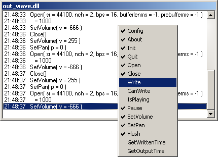

# out_bridge

## About

With the *Outbridge Winamp Plugin* (a.k.a. **out_bridge**)
you can monitor the communication between
another output plugin
and the Winamp host application.

To monitor `out_wave.dll` for instance,
you would rename files like this:

- `out_wave.dll` → `slave_out_wave.dll`
- `out_bridge.dll` → `out_wave.dll`

## History

### 2.2 (2006-03-29)

### 2.1 (2006-02-02)

### 1.0 (2005-08-28)
